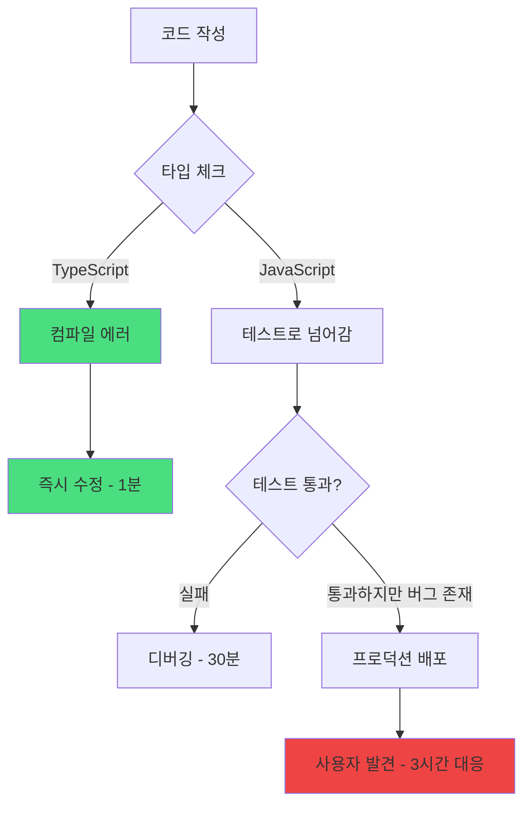
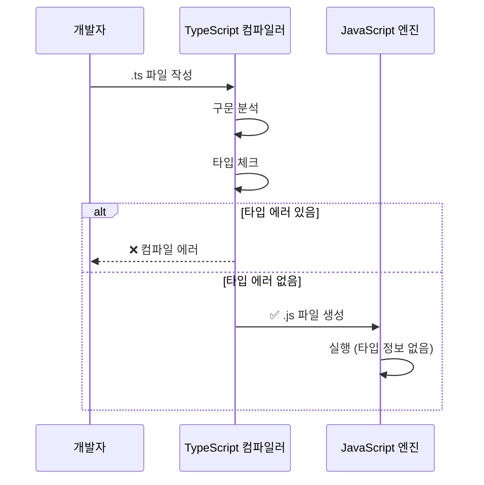
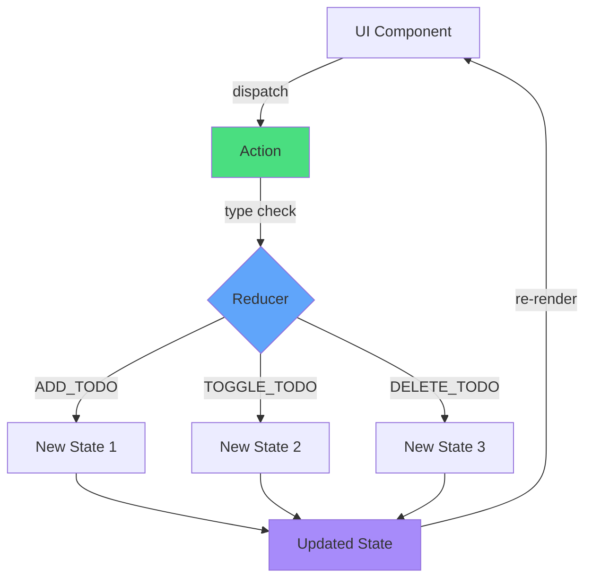
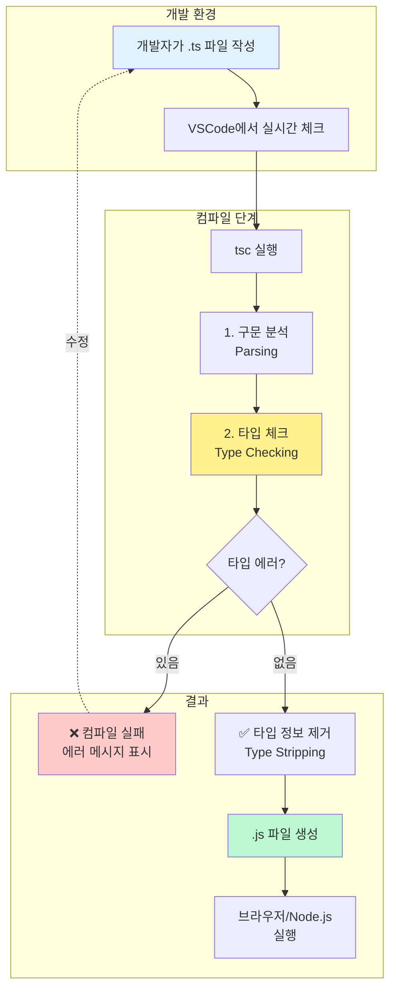
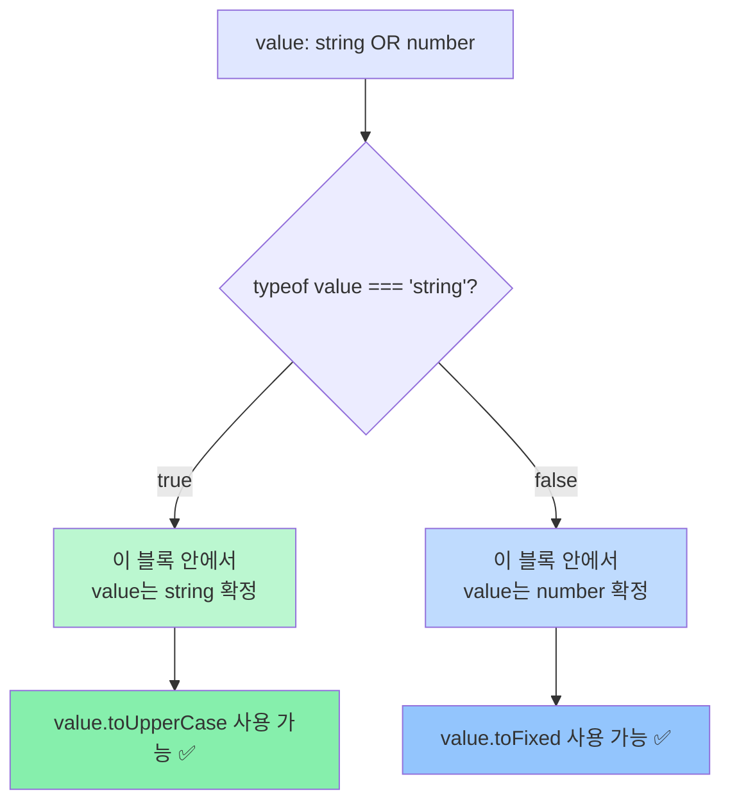
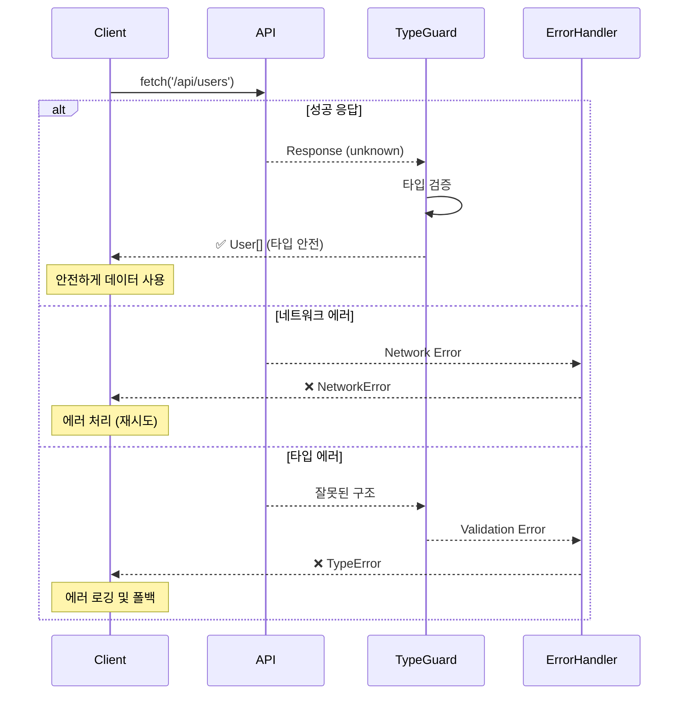
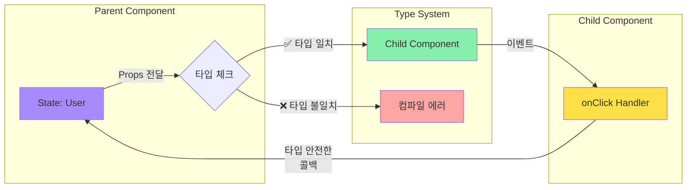

# TypeScript Academy 구축 콘티 & 기획서

> **안티그라비티에게**: 이 문서는 TypeScript 교육 페이지의 완전한 청사진입니다. 각 챕터별 콘텐츠 구성, 삽화 디렉션, 인터랙티브 요소를 상세히 기술했습니다. 코딩은 당신이, 기획과 콘텐츠 디렉션은 이 문서가 담당합니다.

---

## 🎯 프로젝트 핵심 컨셉

**"타입은 약속이다"** - 전체 사이트를 관통하는 메타포

TypeScript를 "제약"이 아닌 "약속"으로 이해시키는 것이 핵심입니다. 
- 약속을 지키면 → 안전한 코드
- 약속을 어기면 → 컴파일러가 미리 알려줌

---

## 📐 전체 사이트 구조

```
홈페이지 (랜딩)
    ↓
9개 챕터 (순차 학습)
    ↓
실습 플레이그라운드
```

### 네비게이션 플로우
1. **좌측 사이드바**: 전체 목차 (항상 고정)
2. **상단 헤더**: 다크모드, 검색, 진행률
3. **하단 네비게이션**: 이전/다음 챕터 버튼
4. **우측 사이드바** (desktop): 현재 페이지 내 목차

---

## 🏠 홈페이지 (랜딩) 구성

### Hero Section
```
[대형 타이틀]
TypeScript를 
제대로 이해하는 방법

[서브 카피]
추상적인 타입 시스템을
시각화와 실습으로 완전히 정복하세요

[CTA 버튼]
학습 시작하기 →
```

### 나노바나나 히어로 일러스트 디렉션
```
중앙에 큰 🍌(JavaScript)가 있고
그 주위를 투명한 보호막(TypeScript)이 감싸는 이미지

JavaScript 바나나 위에 작은 버그들(🐛)이 붙어있고
TypeScript 보호막이 이 버그들을 막아내는 모습

애니메이션: 버그가 다가오면 보호막이 반짝이며 튕겨냄
```

### 3가지 핵심 가치 제안 (아이콘 + 텍스트)

**1. 시각적 학습**
- 아이콘: 🎨 팔레트 + 🍌
- 텍스트: "추상적인 타입을 눈으로 보고 이해하세요"

**2. 실전 중심**
- 아이콘: 💼 서류가방 + ⚛️ React 로고
- 텍스트: "React, Next.js 실무 패턴까지 한 번에"

**3. 인터랙티브 실습**
- 아이콘: ⚡ 번개 + 💻 코드
- 텍스트: "실시간 타입 체크로 즉시 피드백"

### 챕터 미리보기 카드 (9개)
각 카드 구성:
- 챕터 번호 + 제목
- 1줄 설명
- 예상 소요 시간
- 난이도 표시 (●○○○○)
- 썸네일 이미지 (나노바나나 스타일)

---

## 📚 챕터별 상세 콘티

---

## Chapter 01: Why TypeScript? (배경)

### 학습 목표
"왜 TypeScript가 필요한지" 명확히 이해하고, JavaScript의 한계를 체감하게 만들기

### 섹션 구성

#### 1.1 JavaScript의 자유와 혼돈
**콘텐츠 디렉션**:
```
[텍스트]
JavaScript는 자유롭습니다. 
너무 자유로워서 위험합니다.

[실제 버그 사례 소개]
- Stripe의 타입 에러로 인한 과금 오류 (실화 기반)
- 함수에 숫자를 넘겨야 하는데 문자열을 넘긴 사례
- undefined를 읽으려다 크래시 나는 사례
```

**나노바나나 일러스트 #1**: "자유로운 바나나의 여정"
```
Scene 1: 🍌 바나나가 신나게 자유롭게 날아다님
Scene 2: 🍌가 예상치 못한 곳(화산🌋)에 떨어짐
Scene 3: 💥 폭발
Scene 4: 😱 개발자의 놀란 얼굴

캡션: "JavaScript는 뭐든 허용합니다. 런타임에 터지기 전까지는."
```

**인터랙티브 요소**: 
- "버그 찾기 게임" - 5줄짜리 JavaScript 코드, 사용자가 버그를 찾아 클릭
- 정답 클릭 시: TypeScript로 어떻게 막을 수 있는지 애니메이션

#### 1.2 타입 에러의 비용
**콘텐츠 디렉션**:
```
[인포그래픽]
타입 에러를 발견하는 시점:

작성 시 (TypeScript) → 비용: $1
컴파일 시 (TypeScript) → 비용: $10  
테스트 시 (JavaScript) → 비용: $100
프로덕션 (JavaScript) → 비용: $10,000

[실제 통계]
- Airbnb: TypeScript 도입 후 38% 버그 감소
- Slack: 타입 에러 관련 버그 70% 감소
```

**차트 디렉션** (머메이드):


#### 1.3 TypeScript가 해결하는 것들
**콘텐츠 디렉션**:
```
[비교 테이블]
| 문제 | JavaScript | TypeScript |
|------|-----------|-----------|
| 오타 | 런타임 에러 | 작성 중 감지 |
| 잘못된 타입 전달 | undefined 에러 | 컴파일 에러 |
| API 응답 변경 | 예상치 못한 크래시 | 타입 불일치 경고 |
| 리팩토링 | 누락된 수정으로 버그 | 모든 영향 범위 추적 |
```

**나노바나나 일러스트 #2**: "TypeScript 보디가드"
```
왼쪽: JavaScript 세계
- 🍌 바나나가 여러 위험(🔥불, 💧물, ⚡번개)에 노출
- 곳곳에서 💥 폭발

오른쪽: TypeScript 세계
- 🍌 바나나 주위에 🛡️ 방패를 든 보디가드
- 위험이 다가오면 보디가드가 "STOP! ✋" 표지판 들어올림
- 🍌는 안전하게 목적지 도착

캡션: "TypeScript는 당신의 코드를 지키는 보디가드입니다"
```

#### 1.4 언제 TypeScript를 써야 할까?
**콘텐츠 디렉션**:
```
[Decision Tree]
                프로젝트 시작
                    ↓
            팀 규모는? 
        ↙           ↘
    1-2명          3명 이상
       ↓               ↓
    기간은?        TypeScript ✅
   ↙    ↘
1주 이하  1주 이상
   ↓        ↓
  JS 가능  TypeScript 권장
```

**실무 조언 박스**:
```
💡 Pro Tip

TypeScript를 피해야 하는 경우:
- 빠른 프로토타입 (1-2일)
- 일회성 스크립트

TypeScript를 강력 추천하는 경우:
✅ 3명 이상 팀 프로젝트
✅ 6개월 이상 유지보수
✅ 라이브러리/패키지 개발
✅ 복잡한 비즈니스 로직
```

---

## Chapter 02: How TypeScript Works (작동 원리)

### 학습 목표
"TypeScript는 마법이 아니다" - 컴파일 과정을 명확히 이해

### 섹션 구성

#### 2.1 컴파일? 트랜스파일?
**콘텐츠 디렉션**:
```
[개념 정리]
컴파일 (Compile):
고수준 언어 → 저수준 언어
예: C → 기계어

트랜스파일 (Transpile):
고수준 언어 → 다른 고수준 언어  
예: TypeScript → JavaScript

TypeScript는 엄밀히 말하면 "트랜스파일러"
하지만 업계에서는 "컴파일"이라고 통칭
```

**나노바나나 일러스트 #3**: "TypeScript 공장"
```
[컨베이어 벨트 스타일 다이어그램]

입구: .ts 파일 📄 (타입 정보가 가득한 바나나)
    ↓
[검수대 1] 🔍 구문 분석 (Parsing)
    ↓
[검수대 2] 🔍 타입 체크 (Type Checking)
    ↓ 
[기계] ⚙️ 타입 정보 제거 (Stripping)
    ↓
출구: .js 파일 📄 (깨끗한 JavaScript 바나나)

옆에 "불합격" 박스: ❌ 타입 에러 발견된 것들
```

**머메이드 다이어그램**:


#### 2.2 타입은 런타임에 사라진다
**콘텐츠 디렉션**:
```
[핵심 개념 강조 박스]
⚠️ 중요: TypeScript의 타입은 런타임에 존재하지 않습니다!

이것이 의미하는 것:
1. 타입 체크는 오직 컴파일 타임에만
2. 실행되는 것은 순수한 JavaScript
3. 타입으로 런타임 동작을 제어할 수 없음
```

**Before/After 비교 인터랙티브**:
```
[슬라이더 형식]

← TypeScript 코드 (컴파일 전)
function greet(name: string): string {
    return `Hello, ${name}!`;
}

→ JavaScript 코드 (컴파일 후)
function greet(name) {
    return `Hello, ${name}!`;
}

[애니메이션]
슬라이더를 움직이면 ": string" 부분이 서서히 사라지는 효과
```

**나노바나나 일러스트 #4**: "타입 정보의 일생"
```
Act 1 (개발 시간):
🍌 바나나에 스티커가 잔뜩 붙어있음
스티커 내용: "string", "number", "User"
📝 개발자가 보며 안심

Act 2 (컴파일):
⚙️ 기계가 스티커를 하나씩 떼어냄
✅ 검수는 완료

Act 3 (런타임):
🍌 깨끗한 바나나만 남음
스티커는 모두 사라진 상태
💻 브라우저는 깨끗한 바나나만 실행

캡션: "타입은 개발자를 위한 도구. 실행 시점엔 사라집니다."
```

#### 2.3 TSC의 두 가지 역할
**콘텐츠 디렉션**:
```
[2단 레이아웃]

┌─────────────────────┬─────────────────────┐
│  역할 1: 타입 체커  │  역할 2: 컴파일러   │
├─────────────────────┼─────────────────────┤
│ • 타입 에러 찾기    │ • .ts → .js 변환    │
│ • 타입 추론         │ • 최신 문법 → 구버전│
│ • IDE 지원          │ • 모듈 시스템 변환  │
│                     │                     │
│ 🔍 경찰 역할        │ ⚙️ 번역기 역할     │
└─────────────────────┴─────────────────────┘

[중요 포인트]
이 두 역할은 독립적으로 작동합니다!
• 타입 에러가 있어도 .js는 생성 가능 (--noEmitOnError false)
• .js만 필요하면 다른 도구(Babel, esbuild) 사용 가능
```

**인터랙티브 데모**:
```
[코드 에디터]
왼쪽: TypeScript 코드 (의도적으로 타입 에러 포함)

const age: number = "30"; // ❌ 타입 에러

오른쪽: 컴파일 결과
- 상단: 에러 메시지 표시
- 하단: 그래도 생성된 JavaScript 코드

const age = "30"; // 타입 정보만 제거됨

[버튼] "컴파일 해보기" → 실제로 tsc 실행하는 시뮬레이션
```

#### 2.4 tsconfig.json의 역할
**콘텐츠 디렉션**:
```
[비유로 설명]
tsconfig.json = TypeScript 컴파일러의 설정 파일

마치 자동차의 계기판처럼:
🎚️ strict: 안전벨트 착용 여부
🎚️ target: 어느 시대 자동차로 만들지 (ES5/ES2020)
🎚️ module: 짐을 어떻게 실을지 (CommonJS/ESM)
🎚️ outDir: 완성품을 어디에 둘지

[핵심 옵션 3가지만 먼저]
{
  "compilerOptions": {
    "strict": true,           // 👈 항상 켜세요!
    "target": "ES2020",       // 👈 브라우저 지원 범위
    "module": "ESNext"        // 👈 최신 모듈 문법
  }
}
```

**나노바나나 일러스트 #5**: "설정의 힘"
```
[3단 비교]

느슨한 설정 (strict: false):
🍌 바나나가 느슨한 그물망 위에서 자유롭게 움직임
❌ 몇몇 버그(🐛)가 빠져나감

보통 설정:
🍌 바나나가 적당한 울타리 안에 있음
⚠️ 큰 버그는 막지만 작은 건 통과

엄격한 설정 (strict: true):
🍌 바나나가 투명한 방 안에 안전하게 보호됨
✅ 모든 버그 차단

캡션: "strict: true는 처음엔 답답하지만, 나중에 감사하게 됩니다"
```

---

## Chapter 03: Development Environment (개발 환경)

### 학습 목표
실제로 TypeScript 프로젝트를 시작할 수 있는 환경 구축

### 섹션 구성

#### 3.1 프로젝트 초기화
**콘텐츠 디렉션**:
```
[단계별 가이드]

Step 1: Node.js 설치 확인
$ node -v
v20.0.0 ← 18 이상이면 OK

Step 2: TypeScript 설치
$ npm install -D typescript

Step 3: tsconfig.json 생성
$ npx tsc --init

[실습 버튼]
"직접 해보기" → 가상 터미널에서 실제 명령어 실행 시뮬레이션
```

**나노바나나 일러스트 #6**: "프로젝트 준비"
```
[만화 스타일 순서도]

1. 📦 빈 상자 (새 프로젝트)
2. 🍌 바나나 넣기 (코드 작성)
3. 🔧 공구 설치 (TypeScript 설치)
4. 📋 설명서 작성 (tsconfig.json)
5. ✅ 준비 완료

각 단계마다 작은 바나나 캐릭터가 체크리스트에 체크하는 모습
```

#### 3.2 tsconfig.json 완전 정복
**콘텐츠 디렉션**:
```
[인터랙티브 설정 생성기]

사용자가 질문에 답하면 맞춤형 tsconfig.json 생성:

Q1: 프로젝트 유형은?
○ Node.js 백엔드
○ React 프론트엔드  
○ Next.js
○ 라이브러리

Q2: 얼마나 엄격하게?
○ 느슨 (입문자)
○ 보통 (일반)
○ 엄격 (권장) ⭐
○ 극도로 엄격

Q3: 브라우저 지원은?
○ 최신만 (ES2020+)
○ 대부분 (ES2016+)
○ 구형 포함 (ES5)

[결과] → 복사 가능한 tsconfig.json 생성
```

**중요 옵션 설명** (아코디언 형식):
```
▼ strict (엄격 모드)
  모든 엄격한 타입 체크 활성화
  권장: true
  이유: 타입스크립트를 쓰는 이유!

▼ noImplicitAny
  암시적 any 타입 금지
  예: function foo(x) ← x가 any면 에러
  
▼ strictNullChecks
  null/undefined 명시적 처리
  가장 많은 버그를 잡아줌

▼ target
  어떤 JavaScript 버전으로 컴파일?
  ES2020 권장 (대부분의 브라우저 지원)

... (펼쳐서 더 보기)
```

#### 3.3 IDE 설정 (VSCode)
**콘텐츠 디렉션**:
```
[필수 확장 프로그램]

1. ✅ 기본 TypeScript 지원 (내장됨)
2. ESLint
3. Prettier  
4. Error Lens (에러를 인라인으로 표시)

[설정 권장사항]
// .vscode/settings.json
{
  "editor.formatOnSave": true,
  "editor.codeActionsOnSave": {
    "source.fixAll.eslint": true
  },
  "typescript.updateImportsOnFileMove.enabled": "always"
}

[GIF 또는 비디오]
- 타입 에러가 즉시 빨간 줄로 표시되는 모습
- 자동완성이 타입 정보를 보여주는 모습
- 리팩토링 시 자동으로 import 업데이트되는 모습
```

**나노바나나 일러스트 #7**: "IDE는 당신의 비서"
```
[사무실 장면]

왼쪽: 비서 없이 일하는 개발자
- 🍌 개발자가 서류 더미에 파묻혀 있음
- ❌ 에러를 나중에 발견
- 😓 힘들어하는 표정

오른쪽: IDE 비서와 함께
- 🍌 개발자 옆에 작은 로봇 비서
- 로봇이 "여기 오타!" 즉시 알려줌
- ✅ 자동완성 제안
- 😊 여유로운 표정

캡션: "좋은 도구는 당신을 더 나은 개발자로 만듭니다"
```

#### 3.4 린팅과 포매팅
**콘텐츠 디렉션**:
```
[개념 비교]

TypeScript Compiler (tsc)
역할: 타입 에러 체크
예: "number인데 string을 넣었어요!"

ESLint
역할: 코드 품질 체크
예: "사용하지 않는 변수가 있어요"
예: "== 대신 ===를 쓰세요"

Prettier
역할: 코드 스타일 통일
예: "탭 대신 스페이스 2칸"
예: "작은따옴표로 통일"

[다이어그램]
코드 작성
    ↓
Prettier → 포맷팅 ✨
    ↓
ESLint → 코드 품질 검사 🔍
    ↓
tsc → 타입 체크 🛡️
    ↓
완벽한 코드! ✅
```

**실습: 설정 파일 생성**
```
[버튼 클릭 형식]

"ESLint 설정 생성" 버튼
→ .eslintrc.json 파일 생성
→ 각 규칙 설명 툴팁

"Prettier 설정 생성" 버튼  
→ .prettierrc 파일 생성
→ 미리보기로 포맷팅 결과 확인

"한 번에 설정하기" 버튼
→ 모든 설정 파일 + package.json 스크립트 자동 생성
```

---

## Chapter 04: Basic Types (기초 문법)

### 학습 목표
TypeScript의 기본 타입을 완벽히 이해하고 실전에서 사용

### 섹션 구성

#### 4.1 Primitive Types (원시 타입)
**콘텐츠 디렉션**:
```
[타입별 카드 레이아웃]

┌─────────────────┐
│  string 🔤      │
│  텍스트 데이터  │
│                 │
│  "Hello"        │
│  'TypeScript'   │
│  `template`     │
└─────────────────┘

┌─────────────────┐
│  number 🔢      │
│  숫자 (정수/실수)│
│                 │
│  42             │
│  3.14           │
│  -10            │
└─────────────────┘

┌─────────────────┐
│  boolean ✓      │
│  참/거짓        │
│                 │
│  true           │
│  false          │
└─────────────────┘

... (나머지 타입들)
```

**나노바나나 일러스트 #8**: "타입의 왕국"
```
[판타지 맵 스타일]

중앙: "타입 왕국" 성🏰

구역별 마을:
- 📝 String 마을: 글자들이 사는 곳
- 🔢 Number 마을: 숫자들이 사는 곳  
- ✓ Boolean 마을: true/false 두 주민만
- 🗺️ Object 마을: 복잡한 구조의 대저택
- 📦 Array 마을: 같은 타입들이 줄지어 사는 곳

경계에 검문소(타입 체커): 잘못된 주민은 입장 불가

캡션: "각 타입은 자신의 영역이 있습니다"
```

**인터랙티브 퀴즈**:
```
[드래그 앤 드롭]

왼쪽: 값들
- "hello"
- 42
- true
- null
- undefined

오른쪽: 타입 박스
- string
- number  
- boolean

사용자가 올바른 타입에 드래그하면 ✅
틀리면 ❌ + 설명
```

#### 4.2 Array & Tuple
**콘텐츠 디렉션**:
```
[비교 표]

Array (배열): 같은 타입의 목록
────────────────────────────
선언: number[] 또는 Array<number>
예시: [1, 2, 3, 4, 5]
특징: 길이 가변, 같은 타입만

Tuple (튜플): 정확한 개수와 타입
────────────────────────────
선언: [string, number]
예시: ["John", 30]
특징: 길이 고정, 각 위치마다 다른 타입 가능

[언제 뭘 쓸까?]
Array → 동일한 데이터의 리스트
  예: 사용자 목록, 점수 목록

Tuple → 고정된 구조
  예: 좌표 [x, y], RGB [r, g, b]
```

**나노바나나 일러스트 #9**: "배열 vs 튜플"
```
[좌우 비교]

왼쪽: Array (배열)
🍌🍌🍌🍌🍌 (같은 바나나들)
컨베이어 벨트처럼 무한정 추가 가능
"바나나 박스" 라벨

오른쪽: Tuple (튜플)
🍌🍎🍊 (정확히 3개, 각각 다름)
딱 맞는 칸막이 상자
"과일 세트" 라벨

캡션: 
Array = "같은 것들의 리스트"
Tuple = "정해진 조합"
```

**인터랙티브 예제**:
```
[라이브 코드 에디터]

// 배열: 같은 타입들
const scores: number[] = [95, 87, 91];
scores.push(88); // ✅ OK

// 튜플: 정확한 구조
const user: [string, number] = ["Alice", 25];
user[0] = "Bob";    // ✅ OK
user[0] = 30;       // ❌ Error!

[사용자가 직접 수정하며 에러 확인 가능]
```

#### 4.3 Object & Interface
**콘텐츠 디렉션**:
```
[개념 설명]

객체는 "설계도"가 필요합니다.
TypeScript에서는 두 가지 방법:

1️⃣ Type Alias (타입 별칭)
type User = {
  name: string;
  age: number;
};

2️⃣ Interface (인터페이스)
interface User {
  name: string;
  age: number;
}

[차이점은 나중에 배움 - 일단은 비슷하다고 이해]

[실전 패턴]
// 선택적 속성 (Optional)
interface User {
  name: string;
  age?: number;  // ← 있어도 되고 없어도 됨
}

// 읽기 전용 (Readonly)
interface Config {
  readonly apiKey: string;  // ← 수정 불가
}
```

**나노바나나 일러스트 #10**: "객체는 설계도"
```
[건축 현장 비유]

상단: 설계도 📋 (Interface)
┌─────────────────┐
│ User 설계도     │
│ - 이름: 문자    │
│ - 나이: 숫자    │
└─────────────────┘

하단: 실제 건물 🏢 (Object)
const user = {
  name: "정원",
  age: 30
}

작은 감독관(타입 체커)이 설계도와 건물을 비교하며 체크

잘못된 건물 예시:
age: "서른" ← ❌ 감독관이 "숫자여야 합니다!" 팻말 듦

캡션: "설계도 없이 건물을 지으면 위험합니다"
```

#### 4.4 Function Types
**콘텐츠 디렉션**:
```
[함수 시그니처 해부]

function greet(name: string): string {
//       ────  ─────  ────   ──────
//        |      |      |       |
//      함수명  매개변수  입력   출력
//                      타입   타입
  return `Hello, ${name}!`;
}

[왜 중요한가?]
✅ 함수를 쓰는 사람이 뭘 넣어야 하는지 알 수 있음
✅ 함수가 뭘 돌려주는지 명확함
✅ 실수로 잘못된 값을 넘기면 즉시 에러

[화살표 함수]
const greet = (name: string): string => {
  return `Hello, ${name}!`;
};

[더 간단하게]
const greet = (name: string): string => `Hello, ${name}!`;
```

**나노바나나 일러스트 #11**: "함수는 기계"
```
[공장 기계 다이어그램]

         ┌──────────────┐
입력 →   │   greet()    │   → 출력
🍌      │   기계       │      📦
string  │   처리중...   │   string
         └──────────────┘

잘못된 입력 시도:
42(number) → 기계 → 🚫 "문자열만 가능!" 경고등

올바른 사용:
"정원"(string) → 기계 → "Hello, 정원!"(string) ✅

캡션: "함수는 약속된 입력만 받고, 약속된 출력만 돌려줍니다"
```

**인터랙티브 실습**:
```
[함수 시그니처 퍼즐]

사용자가 빈칸을 채워넣기:

function calculate(
  a: _______,        // number
  b: _______,        // number  
  operation: _______  // string
): _______ {         // number
  // ...
}

정답 확인 후:
✅ "맞았습니다! 이제 이 함수는 타입 안전합니다."
```

#### 4.5 Union & Intersection
**콘텐츠 디렉션**:
```
[Union (|) - "또는"]

type Result = string | number;

const value1: Result = "success";  // ✅
const value2: Result = 200;        // ✅
const value3: Result = true;       // ❌

[실전 사용]
// API 응답: 성공하면 데이터, 실패하면 에러 메시지
type ApiResponse = User | ErrorMessage;

// 이벤트 타입: 여러 종류 중 하나
type Event = ClickEvent | KeyEvent | MouseEvent;

[Intersection (&) - "그리고"]

type Serializable = {
  serialize(): string;
};

type Loggable = {
  log(): void;
};

type LoggableSerializable = Serializable & Loggable;
// ↑ 두 속성을 모두 가져야 함!
```

**나노바나나 일러스트 #12**: "Union vs Intersection"
```
[벤다이어그램 스타일]

Union (|): 합집합
┌─────────┐  ┌─────────┐
│ 🍌      │  │     🍎  │
│  Banana │  │  Apple  │
│         │  │         │
└─────────┘  └─────────┘
     ↓
┌──────────────────────┐
│  🍌 또는 🍎         │
│  둘 중 하나면 OK     │
└──────────────────────┘

Intersection (&): 교집합
┌─────────┐  
│ 날수있음 │──┐
│   🦅    │  │  ┌─────────┐
└─────────┘  └──│ 수영가능 │
                │   🐟    │
                └─────────┘
      ↓
┌──────────────────────┐
│  날수있고 수영도     │
│  둘 다 되는 오리 🦆  │
└──────────────────────┘

캡션:
| (Union) = "이것 또는 저것"
& (Intersection) = "이것 그리고 저것"
```

**실습 문제**:
```
[시나리오]

사용자는 다음 중 하나로 로그인할 수 있습니다:
- 이메일 + 비밀번호
- 소셜 로그인 (provider + token)

Union을 사용해서 LoginCredentials 타입을 만들어보세요!

[힌트 버튼] → 구조 제시
[정답 보기] → 
type LoginCredentials = 
  | { email: string; password: string }
  | { provider: string; token: string };
```

---

## Chapter 05: Intermediate Concepts (중급 문법)

### 학습 목표
타입 시스템의 진짜 힘을 발휘하는 중급 개념 마스터

### 섹션 구성

#### 5.1 Generics - 타입의 변수
**콘텐츠 디렉션**:
```
[문제 상황 제시]

이런 함수들이 필요합니다:

function wrapInArrayString(value: string): string[] {
  return [value];
}

function wrapInArrayNumber(value: number): number[] {
  return [value];
}

function wrapInArrayBoolean(value: boolean): boolean[] {
  return [value];
}

😱 타입마다 함수를 만들어야 하나요?

[해결책: Generics!]

function wrapInArray<T>(value: T): T[] {
  return [value];
}

// 이제 모든 타입에서 동작!
wrapInArray<string>("hello");   // string[]
wrapInArray<number>(42);         // number[]
wrapInArray<boolean>(true);      // boolean[]

[핵심 개념]
<T>는 "타입 변수" (Type Variable)
- 함수를 호출할 때 타입을 전달
- 그 타입으로 함수 내부가 작동
```

**나노바나나 일러스트 #13**: "제네릭 공장"
```
[공장 시스템]

입구: "어떤 제품을 만들까요?" 선택 패널
[🍌 바나나] [🍎 사과] [🍊 오렌지]

공장 내부: <T> 범용 기계
- 어떤 과일이든 처리 가능
- 입력된 타입에 맞춰 상자 크기 자동 조절

출구: 
- 🍌 선택 → 🍌 상자 나옴
- 🍎 선택 → 🍎 상자 나옴
- 🍊 선택 → 🍊 상자 나옴

일반 공장 (제네릭 없음) vs 범용 공장 (제네릭)
일반: 과일별로 따로 공장 필요 (비효율)
범용: 하나의 공장으로 모든 과일 처리 (효율)

캡션: "제네릭은 재사용 가능한 타입 코드를 만듭니다"
```

**인터랙티브 시뮬레이터**:
```
[제네릭 플레이그라운드]

코드:
function identity<T>(value: T): T {
  return value;
}

[입력 패널]
타입 선택: [string ▼]
값 입력: [안녕하세요]
[실행]

→ 결과: "안녕하세요" (타입: string)

[타입을 number로 변경]
→ 숫자만 입력 가능하게 인터페이스 변경
→ 타입 안전성 실시간 체험
```

#### 5.2 Generic Constraints (제네릭 제약)
**콘텐츠 디렉션**:
```
[문제 상황]

function printLength<T>(value: T): void {
  console.log(value.length); // ❌ Error!
  // T가 length를 가지고 있다는 보장이 없음
}

[해결: Constraint 사용]

function printLength<T extends { length: number }>(value: T): void {
  console.log(value.length); // ✅ OK!
}

printLength("hello");        // ✅ string은 length 있음
printLength([1, 2, 3]);      // ✅ array도 length 있음
printLength(123);            // ❌ number는 length 없음

[개념]
extends = "최소한 이런 조건은 만족해야 함"

[실전 패턴]
// API 응답은 최소한 id를 가져야 함
function updateItem<T extends { id: string }>(item: T) {
  // item.id는 항상 접근 가능
}
```

**나노바나나 일러스트 #14**: "입장 제한"
```
[놀이공원 입구]

제네릭 공장 입구에 경비원 🚷
경비원이 들고 있는 팻말:
"extends { length: number }"
"길이가 있는 것만 입장 가능!"

허가된 입장:
✅ 📝 문자열 (length 있음)
✅ 📦 배열 (length 있음)
✅ 📋 리스트 (length 있음)

거부된 입장:
❌ 🔢 숫자 (length 없음)
❌ ✓ boolean (length 없음)
❌ 🏠 일반 객체 (length 없음)

캡션: "제약조건은 안전장치입니다"
```

#### 5.3 Type Guards & Narrowing
**콘텐츠 디렉션**:
```
[상황 설정]

function process(value: string | number) {
  value.toUpperCase(); // ❌ Error!
  // number일 수도 있는데 toUpperCase()를 호출?
}

[Type Guard로 해결]

function process(value: string | number) {
  if (typeof value === "string") {
    // 이 블록 안에서는 value가 string임을 확신!
    value.toUpperCase(); // ✅ OK!
  } else {
    // 이 블록 안에서는 value가 number
    value.toFixed(2); // ✅ OK!
  }
}

[Type Guard 종류]

1. typeof (원시 타입)
typeof x === "string"
typeof x === "number"

2. instanceof (클래스)
x instanceof Date
x instanceof Error

3. in (속성 존재)
"length" in x

4. Custom Type Guard (직접 만들기)
function isString(x: unknown): x is string {
  return typeof x === "string";
}
```

**나노바나나 일러스트 #15**: "타입 좁히기"
```
[깔때기(Funnel) 다이어그램]

상단 (넓은 입구):
🎁 Unknown Box
"string | number" 라벨

중간 (Type Guard 체크포인트):
🔍 검사대
"typeof === 'string'?"

하단 (분리된 출구):
왼쪽 출구: 📝 string만
오른쪽 출구: 🔢 number만

각 출구에서는 해당 타입의 메서드 사용 가능
📝 → .toUpperCase(), .split()
🔢 → .toFixed(), .toString()

캡션: "Type Guard는 타입을 명확하게 좁혀줍니다"
```

**인터랙티브 디버거**:
```
[단계별 실행]

function example(x: string | number | boolean) {
  // 1단계: x의 타입은? → string | number | boolean
  
  if (typeof x === "string") {
    // 2단계: 이 안에서 x의 타입은? → string
    return x.length;
  }
  
  if (typeof x === "number") {
    // 3단계: 이 안에서 x의 타입은? → number
    return x.toFixed();
  }
  
  // 4단계: 여기서 x의 타입은? → boolean
  return x ? "yes" : "no";
}

[실행 버튼] → 각 단계마다 현재 타입 하이라이트
[퀴즈] "각 지점에서 x의 타입을 맞춰보세요!"
```

#### 5.4 Literal Types
**콘텐츠 디렉션**:
```
[개념 설명]

일반 타입:
let status: string = "success";
status = "pending";  // ✅ 어떤 문자열이든 OK
status = "asdfgh";   // ✅ 이것도 OK (의도하지 않아도)

Literal 타입:
let status: "success" | "pending" | "error";
status = "success";  // ✅ OK
status = "pending";  // ✅ OK
status = "asdfgh";   // ❌ Error! 정해진 값만 가능

[왜 유용한가?]
✅ 오타 방지
✅ 자동완성 지원
✅ 명확한 의도 전달

[실전 사용]
// HTTP 메서드
type HttpMethod = "GET" | "POST" | "PUT" | "DELETE";

// 방향
type Direction = "north" | "south" | "east" | "west";

// 설정값
type Theme = "light" | "dark" | "auto";
```

**나노바나나 일러스트 #16**: "제한된 선택지"
```
[자판기 비유]

일반 string 타입 자판기:
- 버튼이 무한대
- 아무 문자열이나 입력 가능
- "sdfsdf" 같은 이상한 값도 허용 😱

Literal 타입 자판기:
- 버튼이 딱 3개
  [성공] [대기중] [에러]
- 정확히 이 3가지만 선택 가능
- 오타 불가능! ✅

사용자(개발자)가 버튼을 누르면:
- IDE가 자동완성으로 3가지 보여줌
- 잘못된 값 입력 시 즉시 에러

캡션: "선택지를 제한하면 오류가 줄어듭니다"
```

**인터랙티브 비교**:
```
[Split View]

왼쪽: Without Literal Types
─────────────────────────
let status: string = "success";

// 나중에 다른 개발자가...
status = "succeess"; // 오타! 하지만 에러 없음 😱
status = "ok";       // 의도와 다르지만 에러 없음

오른쪽: With Literal Types
─────────────────────────
let status: "success" | "error" = "success";

// 나중에 다른 개발자가...
status = "succeess"; // ❌ 즉시 에러!
status = "ok";       // ❌ 즉시 에러!

[자동완성 데모]
status = " ← 여기서 자동완성 목록 표시
  • success
  • error
```

#### 5.5 Type Assertions
**콘텐츠 디렉션**:
```
[주의: 이것은 "타입 캐스팅"이 아닙니다!]

Type Assertion = "나는 확신한다"
- 런타임에 아무 일도 일어나지 않음
- 단지 컴파일러에게 "내가 더 잘 알아" 라고 말하는 것

[문법]
// 방법 1: as 키워드
const value = someValue as string;

// 방법 2: angle-bracket (React에서 X)
const value = <string>someValue;

[언제 사용?]
1. DOM 조작
const input = document.getElementById("email") as HTMLInputElement;
input.value; // ✅ 이제 .value 사용 가능

2. API 응답 (타입을 알고 있을 때)
const user = JSON.parse(response) as User;

3. 타입 단언이 필요한 복잡한 상황

[⚠️ 위험!]
const num = "hello" as number; // 컴파일러는 믿지만...
console.log(num + 10); // 런타임에 "hello10" 😱

"as"는 책임이 개발자에게!
```

**나노바나나 일러스트 #17**: "타입 단언의 위험"
```
[법정 증언 장면]

판사(컴파일러): "이 상자 안에 뭐가 있나요?"
개발자(증인): "🍌 바나나입니다!"
판사: "확신하나요?"
개발자: "네, as Banana로 확신합니다!"
판사: "좋아요, 믿겠습니다." ✅

[상자를 열었을 때]

Case 1 (정직한 단언):
실제로 🍌 바나나가 들어있음
→ 모두 행복 😊

Case 2 (거짓 단언):
실제로는 🌶️ 고추가 들어있음
→ 런타임 폭발 💥
→ "TypeError: undefined is not a function"

하단 경고문:
⚠️ Type Assertion은 개발자의 책임
거짓말하면 런타임에 크래시!

캡션: "확신할 수 있을 때만 사용하세요"
```

---

## Chapter 06: Advanced Patterns (고급 문법)

### 학습 목표
TypeScript의 고급 기능으로 강력한 타입 시스템 구축

### 섹션 구성

#### 6.1 Utility Types
**콘텐츠 디렉션**:
```
[개념]
TypeScript가 제공하는 "타입 변환 도구"
기존 타입을 변형해서 새로운 타입 생성

[핵심 Utility Types]

1. Partial<T> - 모든 속성을 선택적으로
───────────────────────────────
interface User {
  name: string;
  age: number;
  email: string;
}

type PartialUser = Partial<User>;
// = {
//   name?: string;
//   age?: number;
//   email?: string;
// }

사용 예: 업데이트 함수
function updateUser(id: string, updates: Partial<User>) {
  // 일부만 업데이트 가능!
}

2. Required<T> - 모든 속성을 필수로
───────────────────────────────
type RequiredUser = Required<PartialUser>;
// 다시 모든 속성이 필수가 됨

3. Pick<T, K> - 특정 속성만 선택
───────────────────────────────
type UserPreview = Pick<User, "name" | "email">;
// = {
//   name: string;
//   email: string;
// }

4. Omit<T, K> - 특정 속성 제외
───────────────────────────────
type UserWithoutEmail = Omit<User, "email">;
// = {
//   name: string;
//   age: number;
// }

5. Record<K, T> - 키-값 맵 생성
───────────────────────────────
type Scores = Record<string, number>;
// = {
//   [key: string]: number;
// }

const scores: Scores = {
  math: 95,
  english: 87,
  // 모든 값이 number여야 함
};
```

**나노바나나 일러스트 #18**: "타입 변환 작업장"
```
[공구 작업대 장면]

원재료: User 타입 청사진 📋

작업대 위의 도구들:
🔧 Partial 렌치: 모든 필수(!)를 선택적(?)으로 변환
✂️ Pick 가위: 필요한 부분만 오려냄
🗑️ Omit 지우개: 불필요한 부분 제거
➕ Required 접착제: 선택적을 필수로 고정
📝 Record 스탬프: 일괄 타입 찍기

작업 과정:
User 청사진 → Pick 가위 → UserPreview 완성!
User 청사진 → Partial 렌치 → UpdateUser 완성!

캡션: "Utility Types는 타입을 변형하는 도구입니다"
```

**인터랙티브 Utility Types 생성기**:
```
[선택형 인터페이스]

원본 타입:
interface Product {
  id: string;
  name: string;
  price: number;
  description?: string;
}

도구 선택:
○ Partial - 모든 속성을 선택적으로
○ Required - 모든 속성을 필수로
○ Pick - 특정 속성만 선택
○ Omit - 특정 속성 제외
○ Readonly - 모든 속성을 읽기 전용으로

[Pick 선택 시]
선택할 속성: ☑ id ☑ name ☐ price ☐ description
[생성하기]

결과:
type ProductPreview = Pick<Product, "id" | "name">;
// {
//   id: string;
//   name: string;
// }
```

#### 6.2 Conditional Types
**콘텐츠 디렉션**:
```
[개념]
타입 수준에서의 if-else!

[문법]
T extends U ? X : Y

해석: T가 U에 할당 가능하면 X, 아니면 Y

[기본 예제]
type IsString<T> = T extends string ? "yes" : "no";

type A = IsString<string>;  // "yes"
type B = IsString<number>;  // "no"

[실전 활용]
// 배열이면 요소 타입, 아니면 그대로
type Flatten<T> = T extends Array<infer U> ? U : T;

type Num = Flatten<number[]>;   // number
type Str = Flatten<string>;     // string

// API 응답: 성공이면 데이터, 실패면 에러
type ApiResult<T> = T extends { success: true }
  ? T['data']
  : Error;
```

**나노바나나 일러스트 #19**: "타입 분기점"
```
[철도 분기 장면]

기차(타입 T) 진입 🚂

                ╔══════╗
                ║ 검문소 ║
                ║T extends║
                ║ string?║
                ╚══════╝
                    │
        ┌───────────┴───────────┐
        │                       │
      YES                      NO
        │                       │
    ┌───▼───┐               ┌───▼───┐
    │Route A│               │Route B│
    │  "O"  │               │  "X"  │
    └───────┘               └───────┘

예시:
string 기차 → YES 경로 → "타입 O"
number 기차 → NO 경로 → "타입 X"

캡션: "Conditional Types는 타입을 검사해서 다른 타입으로 변환합니다"
```

**단계별 학습**:
```
[Level 1: 기본]
type IsNumber<T> = T extends number ? true : false;

[사용자 퀴즈]
IsNumber<42>는? → [true / false]
IsNumber<"hello">는? → [true / false]

[Level 2: 중급]
type ArrayElement<T> = T extends (infer U)[] ? U : never;

[사용자 퀴즈]
ArrayElement<string[]>는? → [string / string[] / never]

[Level 3: 고급]
실제 React에서 사용되는 패턴:
type ElementType<T> = T extends React.ComponentType<infer P>
  ? P
  : never;
```

#### 6.3 Mapped Types
**콘텐츠 디렉션**:
```
[개념]
기존 타입의 모든 속성을 순회하며 변환

[문법]
type Mapped<T> = {
  [K in keyof T]: 변환 로직
};

[keyof 이해하기]
interface User {
  name: string;
  age: number;
}

type UserKeys = keyof User; // "name" | "age"

[Mapped Type 실습]
// 모든 속성을 boolean으로
type Flags<T> = {
  [K in keyof T]: boolean;
};

type UserFlags = Flags<User>;
// {
//   name: boolean;
//   age: boolean;
// }

[실전 패턴]
// 모든 속성을 Promise로 감싸기
type Promisify<T> = {
  [K in keyof T]: Promise<T[K]>;
};

// 모든 속성을 함수로 만들기
type Getters<T> = {
  [K in keyof T as `get${Capitalize<string & K>}`]: () => T[K];
};

interface User {
  name: string;
  age: number;
}

type UserGetters = Getters<User>;
// {
//   getName: () => string;
//   getAge: () => number;
// }
```

**나노바나나 일러스트 #20**: "타입 변환 공장 라인"
```
[컨베이어 벨트 시스템]

입력: User 타입
┌──────────┐
│ name: 📝 │
│ age: 🔢  │
└──────────┘
      ↓
[Mapped Type 기계] ⚙️
"[K in keyof T]: boolean"
      ↓
각 속성이 변환되는 과정:
name: 📝 → ✓ (boolean)
age: 🔢 → ✓ (boolean)
      ↓
출력: UserFlags 타입
┌──────────┐
│ name: ✓  │
│ age: ✓   │
└──────────┘

다른 변환 예시:
[Promise 기계] → 모든 것을 🎁(Promise)로 포장
[Function 기계] → 모든 것을 ƒ(함수)로 변환

캡션: "Mapped Types는 타입의 모든 속성을 일괄 변환합니다"
```

#### 6.4 Template Literal Types
**콘텐츠 디렉션**:
```
[개념]
문자열 리터럴 타입을 템플릿처럼 조합

[기본 문법]
type Greeting = `Hello ${string}`;

const g1: Greeting = "Hello World"; // ✅
const g2: Greeting = "Hello TypeScript"; // ✅
const g3: Greeting = "Hi there"; // ❌

[실전 활용 1: 이벤트 이름]
type EventName = `on${Capitalize<string>}`;

const event1: EventName = "onClick"; // ✅
const event2: EventName = "onSubmit"; // ✅
const event3: EventName = "click"; // ❌ on으로 시작 안함

[실전 활용 2: CSS 속성]
type CSSProperty = 
  | `margin-${"top" | "right" | "bottom" | "left"}`
  | `padding-${"top" | "right" | "bottom" | "left"}`;

// "margin-top" | "margin-right" | ... | "padding-left"

[실전 활용 3: API 라우트]
type Method = "GET" | "POST" | "PUT" | "DELETE";
type Route = "/users" | "/posts" | "/comments";

type ApiEndpoint = `${Method} ${Route}`;
// "GET /users" | "POST /users" | ... (12가지 조합)

[고급: Key Remapping]
type Getters<T> = {
  [K in keyof T as `get${Capitalize<string & K>}`]: () => T[K]
};
```

**나노바나나 일러스트 #21**: "문자열 레고 블록"
```
[레고 조립 장면]

기본 블록들:
🧱 "get"
🧱 "set"
🧱 "name"
🧱 "age"
🧱 "email"

조합 규칙 (Template):
`${prefix}${Capitalize<property>}`

조립 과정:
"get" + "Name" → "getName" ✅
"set" + "Age" → "setAge" ✅
"get" + "Email" → "getEmail" ✅

불가능한 조합:
"get" + "123" → ❌ 속성 이름이 아님
"hello" + "name" → ❌ prefix가 아님

완성된 타입:
type Methods = 
  | "getName" 
  | "getAge" 
  | "getEmail"
  | "setName"
  | "setAge"
  | "setEmail"

캡션: "Template Literal Types로 타입을 조합하세요"
```

**인터랙티브 Template Builder**:
```
[단계별 빌더]

Step 1: Prefix 선택
[get▼] [set▼] [on▼]

Step 2: 속성 목록
interface User {
  name: string;
  age: number;
  email: string;
}

Step 3: 변환 규칙
☑ Capitalize first letter
☐ UPPERCASE all
☐ Add underscore

[생성하기]

결과:
type UserGetters = 
  | "getName"
  | "getAge"
  | "getEmail"

[코드 복사]
```

---

## Chapter 07: Common Patterns (실무 패턴)

### 학습 목표
실제 프로젝트에서 자주 사용하는 TypeScript 패턴

### 섹션 구성

#### 7.1 API Response 타입 정의
**콘텐츠 디렉션**:
```
[문제 상황]
API에서 데이터를 받아올 때, 응답 구조가 명확하지 않으면:
- undefined 에러 빈번
- 자동완성 불가
- 리팩토링 어려움

[해결 패턴 1: 기본 구조]
interface ApiResponse<T> {
  success: boolean;
  data: T;
  error?: string;
}

// 사용
interface User {
  id: string;
  name: string;
  email: string;
}

type UserResponse = ApiResponse<User>;

// API 호출
async function getUser(id: string): Promise<UserResponse> {
  const response = await fetch(`/api/users/${id}`);
  return response.json();
}

[해결 패턴 2: Discriminated Union]
type ApiResult<T> =
  | { success: true; data: T }
  | { success: false; error: string };

// 타입 가드로 안전하게 사용
const result = await getUser("123");
if (result.success) {
  console.log(result.data.name); // ✅ data 보장
} else {
  console.log(result.error); // ✅ error 보장
}

[실전 예제: Pagination]
interface PaginatedResponse<T> {
  items: T[];
  total: number;
  page: number;
  pageSize: number;
  hasMore: boolean;
}

type UserListResponse = PaginatedResponse<User>;
```

**나노바나나 일러스트 #22**: "API 응답 패키징"
```
[배송 시스템 비유]

서버 (레스토랑) 🏪
      ↓
패키징 시스템 📦
┌─────────────────┐
│ ApiResponse<T>  │
│                 │
│ ✓ success       │
│ 📦 data: T      │
│ ⚠️ error?       │
└─────────────────┘
      ↓
클라이언트 (고객) 🏠

성공 케이스:
📦 상자 안에 🍌 (데이터) 들어있음
→ success: true, data 있음

실패 케이스:
📦 상자에 ⚠️ (에러 메시지) 들어있음
→ success: false, error 있음

타입 가드 (검수):
상자를 열기 전에 success 확인
→ 안전하게 내용물 꺼내기

캡션: "API 응답을 타입으로 감싸면 안전합니다"
```

**실습 템플릿**:
```
[연습 문제]

다음 API 응답을 타입으로 정의하세요:

// GET /api/products
{
  "products": [
    { "id": "1", "name": "Laptop", "price": 1200 },
    { "id": "2", "name": "Mouse", "price": 25 }
  ],
  "total": 156,
  "page": 1,
  "hasNext": true
}

[힌트] 클릭 → 구조 힌트 제공
[정답] 클릭 → 모범 답안 + 설명
```

#### 7.2 Error Handling Pattern
**콘텐츠 디렉션**:
```
[문제]
JavaScript의 Error는 타입 정보가 부족:
try {
  await riskyOperation();
} catch (error) {
  // error는 unknown 타입
  // 어떤 에러인지 알 수 없음
}

[패턴 1: Custom Error Classes]
class ValidationError extends Error {
  constructor(
    message: string,
    public field: string
  ) {
    super(message);
    this.name = "ValidationError";
  }
}

class NetworkError extends Error {
  constructor(
    message: string,
    public statusCode: number
  ) {
    super(message);
    this.name = "NetworkError";
  }
}

// 사용
try {
  await validateUser(data);
} catch (error) {
  if (error instanceof ValidationError) {
    console.log(`${error.field} is invalid`);
  } else if (error instanceof NetworkError) {
    console.log(`HTTP ${error.statusCode}`);
  }
}

[패턴 2: Result Type (Rust 스타일)]
type Result<T, E = Error> =
  | { ok: true; value: T }
  | { ok: false; error: E };

function divide(a: number, b: number): Result<number> {
  if (b === 0) {
    return { ok: false, error: new Error("Division by zero") };
  }
  return { ok: true, value: a / b };
}

// 사용
const result = divide(10, 2);
if (result.ok) {
  console.log(result.value); // ✅ 타입 안전
} else {
  console.log(result.error.message);
}

[패턴 3: Type Guard Helper]
function isError(error: unknown): error is Error {
  return error instanceof Error;
}

try {
  throw new Error("Something went wrong");
} catch (error) {
  if (isError(error)) {
    console.log(error.message); // ✅ 안전
  }
}
```

**나노바나나 일러스트 #23**: "에러 처리 안전망"
```
[곡예 공연 장면]

상단: 위험한 작업 (API 호출, 파일 읽기)
곡예사(함수)가 공중 그네 🤸

하단: 안전망 3겹

1층 안전망: try-catch
   떨어지는 곡예사를 받아냄

2층 안전망: Type Guard
   "이게 무슨 에러지?" 확인
   ○ ValidationError → 파란 구역
   ○ NetworkError → 빨간 구역
   ○ 기타 Error → 회색 구역

3층 안전망: Error Handler
   각 구역마다 다른 처리
   파란: "입력값을 확인하세요"
   빨간: "네트워크를 확인하세요"
   회색: "관리자에게 문의하세요"

안전망 없는 경우 (왼쪽 작은 그림):
💥 땅에 그대로 추락
"Uncaught Error"

캡션: "에러를 타입으로 구분하면 적절히 대응할 수 있습니다"
```

#### 7.3 State Management Types
**콘텐츠 디렉션**:
```
[문제]
상태 관리 시 타입이 불명확하면:
- 잘못된 액션 디스패치
- 상태 구조 변경 시 오류
- Reducer에서 타입 에러

[패턴: Redux/Zustand 타입]
// State 정의
interface TodoState {
  todos: Todo[];
  filter: "all" | "active" | "completed";
  loading: boolean;
}

// Action 정의 (Discriminated Union)
type TodoAction =
  | { type: "ADD_TODO"; payload: { text: string } }
  | { type: "TOGGLE_TODO"; payload: { id: string } }
  | { type: "DELETE_TODO"; payload: { id: string } }
  | { type: "SET_FILTER"; payload: { filter: TodoState["filter"] } };

// Reducer (타입 안전)
function todoReducer(
  state: TodoState,
  action: TodoAction
): TodoState {
  switch (action.type) {
    case "ADD_TODO":
      // action.payload는 자동으로 { text: string }
      return {
        ...state,
        todos: [...state.todos, {
          id: Date.now().toString(),
          text: action.payload.text,
          completed: false
        }]
      };
    
    case "TOGGLE_TODO":
      // action.payload는 자동으로 { id: string }
      return {
        ...state,
        todos: state.todos.map(todo =>
          todo.id === action.payload.id
            ? { ...todo, completed: !todo.completed }
            : todo
        )
      };
    
    // ... 나머지 케이스
  }
}

[실전 팁]
// Action Creator에도 타입 적용
type ActionCreator = {
  addTodo: (text: string) => Extract<TodoAction, { type: "ADD_TODO" }>;
  toggleTodo: (id: string) => Extract<TodoAction, { type: "TOGGLE_TODO" }>;
  deleteTodo: (id: string) => Extract<TodoAction, { type: "DELETE_TODO" }>;
};

const actions: ActionCreator = {
  addTodo: (text) => ({ type: "ADD_TODO", payload: { text } }),
  toggleTodo: (id) => ({ type: "TOGGLE_TODO", payload: { id } }),
  deleteTodo: (id) => ({ type: "DELETE_TODO", payload: { id } }),
};
```

**다이어그램**:


---

## Chapter 08: React with TypeScript

### 학습 목표
React에서 TypeScript를 완벽하게 사용하기

### 섹션 구성

#### 8.1 Component Props 타입
**콘텐츠 디렉션**:
```
[기본 패턴]
// Props 인터페이스 정의
interface ButtonProps {
  label: string;
  onClick: () => void;
  variant?: "primary" | "secondary";
  disabled?: boolean;
}

// 함수 컴포넌트
function Button({ label, onClick, variant = "primary", disabled }: ButtonProps) {
  return (
    <button 
      onClick={onClick}
      disabled={disabled}
      className={`btn-${variant}`}
    >
      {label}
    </button>
  );
}

// 사용
<Button label="Click me" onClick={() => console.log("Clicked!")} />

[Children Props]
interface CardProps {
  title: string;
  children: React.ReactNode; // ← 이게 핵심!
}

function Card({ title, children }: CardProps) {
  return (
    <div className="card">
      <h2>{title}</h2>
      {children}
    </div>
  );
}

[이벤트 핸들러 타입]
interface FormProps {
  onSubmit: (data: FormData) => void;
  onChange: (e: React.ChangeEvent<HTMLInputElement>) => void;
  onClick: (e: React.MouseEvent<HTMLButtonElement>) => void;
}

[제네릭 컴포넌트]
interface ListProps<T> {
  items: T[];
  renderItem: (item: T) => React.ReactNode;
}

function List<T>({ items, renderItem }: ListProps<T>) {
  return (
    <ul>
      {items.map((item, index) => (
        <li key={index}>{renderItem(item)}</li>
      ))}
    </ul>
  );
}

// 사용
<List
  items={[{ id: 1, name: "Alice" }, { id: 2, name: "Bob" }]}
  renderItem={(user) => <span>{user.name}</span>}
/>
```

**나노바나나 일러스트 #24**: "컴포넌트는 함수"
```
[공장 생산 라인]

입력구 (Props):
┌──────────────┐
│ label: 📝    │
│ onClick: ƒ   │
│ variant: 🎨  │
└──────────────┘
       ↓
[Button 컴포넌트 공장] ⚙️
       ↓
출력구 (JSX):
┌──────────────┐
│   [Click me] │ ← 완성된 버튼
└──────────────┘

타입 체크 검문소 🚧:
- label이 없으면? ❌ 차단
- onClick이 없으면? ❌ 차단
- variant가 이상한 값? ❌ 차단

올바른 Props만 통과! ✅

캡션: "Props 타입은 컴포넌트의 계약서입니다"
```

#### 8.2 Hooks 타이핑
**콘텐츠 디렉션**:
```
[useState]
// 타입 자동 추론
const [count, setCount] = useState(0); // number
const [name, setName] = useState(""); // string

// 명시적 타입 지정
const [user, setUser] = useState<User | null>(null);

// 초기값이 없을 때
const [data, setData] = useState<Data>(); // Data | undefined

[useRef]
// DOM 요소 참조
const inputRef = useRef<HTMLInputElement>(null);
// 사용: inputRef.current?.focus();

// 일반 값 저장
const counterRef = useRef<number>(0);

[useReducer]
interface State {
  count: number;
  error: string | null;
}

type Action =
  | { type: "INCREMENT" }
  | { type: "DECREMENT" }
  | { type: "SET_ERROR"; payload: string };

function reducer(state: State, action: Action): State {
  switch (action.type) {
    case "INCREMENT":
      return { ...state, count: state.count + 1 };
    case "DECREMENT":
      return { ...state, count: state.count - 1 };
    case "SET_ERROR":
      return { ...state, error: action.payload };
  }
}

const [state, dispatch] = useReducer(reducer, { count: 0, error: null });

[useContext]
interface ThemeContextType {
  theme: "light" | "dark";
  toggleTheme: () => void;
}

const ThemeContext = createContext<ThemeContextType | undefined>(undefined);

// Custom Hook으로 안전하게 사용
function useTheme() {
  const context = useContext(ThemeContext);
  if (!context) {
    throw new Error("useTheme must be used within ThemeProvider");
  }
  return context;
}

[Custom Hooks]
function useLocalStorage<T>(key: string, initialValue: T) {
  const [value, setValue] = useState<T>(() => {
    const stored = localStorage.getItem(key);
    return stored ? JSON.parse(stored) : initialValue;
  });

  useEffect(() => {
    localStorage.setItem(key, JSON.stringify(value));
  }, [key, value]);

  return [value, setValue] as const; // ← tuple로 반환
}

// 사용
const [name, setName] = useLocalStorage<string>("name", "Guest");
```

**인터랙티브 Hook 시뮬레이터**:
```
[useState 체험]

초기값 입력: [ 0 ]
타입 지정: [number ▼]

[시뮬레이션 시작]

→ const [count, setCount] = useState<number>(0);

[버튼들]
[setCount(count + 1)] ← 클릭하면 count 증가
[setCount("hello")] ← 클릭 불가 (타입 에러 표시)

현재 count 값: 5
타입 체크: ✅ number
```

#### 8.3 Event Handling
**콘텐츠 디렉션**:
```
[자주 쓰는 이벤트 타입]

// Click
onClick: (e: React.MouseEvent<HTMLButtonElement>) => void

// Change (Input)
onChange: (e: React.ChangeEvent<HTMLInputElement>) => void

// Change (Select)
onChange: (e: React.ChangeEvent<HTMLSelectElement>) => void

// Submit (Form)
onSubmit: (e: React.FormEvent<HTMLFormElement>) => void

// Keyboard
onKeyDown: (e: React.KeyboardEvent<HTMLInputElement>) => void

[실전 예제]
function Form() {
  const [email, setEmail] = useState("");

  const handleChange = (e: React.ChangeEvent<HTMLInputElement>) => {
    setEmail(e.target.value);
  };

  const handleSubmit = (e: React.FormEvent<HTMLFormElement>) => {
    e.preventDefault();
    console.log("Submitted:", email);
  };

  const handleKeyDown = (e: React.KeyboardEvent<HTMLInputElement>) => {
    if (e.key === "Enter") {
      console.log("Enter pressed!");
    }
  };

  return (
    <form onSubmit={handleSubmit}>
      <input
        type="email"
        value={email}
        onChange={handleChange}
        onKeyDown={handleKeyDown}
      />
      <button type="submit">Submit</button>
    </form>
  );
}

[팁: Event 타입 찾기]
1. VSCode에서 이벤트 핸들러에 마우스 오버
2. 표시되는 타입 확인
3. 복사해서 사용

또는 일단 작성하고 에러 메시지에서 확인!
```

---

## Chapter 09: Next.js with TypeScript

### 학습 목표
Next.js에서 TypeScript의 모든 기능 활용

### 섹션 구성

#### 9.1 Page & API Routes
**콘텐츠 디렉션**:
```
[App Router (Next.js 13+)]

// app/page.tsx
export default function HomePage() {
  return <h1>Home</h1>;
}

// 동적 라우트
// app/posts/[id]/page.tsx
interface PageProps {
  params: { id: string };
  searchParams: { [key: string]: string | string[] | undefined };
}

export default async function PostPage({ params, searchParams }: PageProps) {
  const post = await getPost(params.id);
  return <article>{post.title}</article>;
}

[API Routes]

// app/api/users/route.ts
import { NextRequest, NextResponse } from "next/server";

interface User {
  id: string;
  name: string;
}

export async function GET(request: NextRequest) {
  const users: User[] = await getUsers();
  return NextResponse.json(users);
}

export async function POST(request: NextRequest) {
  const body: User = await request.json();
  const newUser = await createUser(body);
  return NextResponse.json(newUser, { status: 201 });
}

[Server Actions (Next.js 14+)]

// app/actions.ts
"use server";

interface FormData {
  name: string;
  email: string;
}

export async function createUser(data: FormData) {
  const user = await db.users.create({ data });
  return { success: true, user };
}

// 사용
// app/page.tsx
import { createUser } from "./actions";

export default function SignupPage() {
  async function handleSubmit(formData: FormData) {
    const data = {
      name: formData.get("name") as string,
      email: formData.get("email") as string,
    };
    const result = await createUser(data);
  }

  return (
    <form action={handleSubmit}>
      {/* form fields */}
    </form>
  );
}

[환경변수 타입 안전성]

// env.d.ts
declare namespace NodeJS {
  interface ProcessEnv {
    DATABASE_URL: string;
    API_KEY: string;
    NEXT_PUBLIC_APP_URL: string;
  }
}

// 이제 자동완성 + 타입 체크!
const dbUrl = process.env.DATABASE_URL; // ✅ string
const wrong = process.env.WRONG_KEY; // ❌ Error
```

**나노바나나 일러스트 #25**: "Next.js 타입 안전 여정"
```
[도시 지도 스타일]

🏠 Client Component 구역
- Props 타입 체크 ✅
- Hook 타입 안전 ✅
- 이벤트 핸들러 타입 ✅

🏢 Server Component 구역  
- async/await 타입 ✅
- Props 타입 체크 ✅
- API 응답 타입 ✅

🌉 다리 (데이터 흐름)
- Server → Client Props ✅
- API Route 타입 ✅

⚙️ Server Actions 터널
- Form Data 타입 ✅
- 반환값 타입 ✅

🔐 환경변수 금고
- process.env 타입 체크 ✅
- 오타 방지 ✅

각 구역마다 작은 가드(타입 체커)가 서 있음
잘못된 타입은 통과 불가! 🚫

캡션: "Next.js 전체가 타입으로 보호됩니다"
```

---

## 🎮 인터랙티브 요소 총정리

### 각 챕터에 들어갈 인터랙티브 요소:

1. **코드 플레이그라운드**
   - Monaco Editor 사용
   - 실시간 타입 체크
   - 에러 하이라이트
   - 자동완성 지원

2. **Before/After 슬라이더**
   - TypeScript vs JavaScript 비교
   - 타입 에러 있는 코드 vs 수정된 코드

3. **타입 퀴즈**
   - 드래그 앤 드롭
   - 선택형
   - 빈칸 채우기

4. **시뮬레이터**
   - 컴파일 과정 시각화
   - Type Guard 동작 시뮬레이션
   - Generics 동작 체험

5. **진행률 트래커**
   - 각 챕터별 완료율
   - 전체 학습 진도
   - 북마크 기능

---

## 🎨 디자인 시스템 (shadcn 기반)

### Color Palette
```
Primary (Blue): 
- 50: #eff6ff
- 500: #3b82f6
- 900: #1e3a8a

Accent (Purple):
- 50: #faf5ff
- 500: #a855f7
- 900: #581c87

Banana (Yellow):
- 50: #fefce8
- 500: #eab308
- 900: #713f12

Success (Green): #22c55e
Error (Red): #ef4444
Warning (Orange): #f97316
```

### Typography
```
Headings: 
- H1: 3rem (48px) bold
- H2: 2.25rem (36px) bold
- H3: 1.875rem (30px) semibold

Body:
- Large: 1.125rem (18px)
- Base: 1rem (16px)
- Small: 0.875rem (14px)

Code:
- Font: 'Fira Code', monospace
- Size: 0.875rem (14px)
```

### Components
```
카드: 둥근 모서리 (8px), 그림자, 호버 효과
버튼: Primary/Secondary variants
입력: 포커스 링, 에러 상태
코드블럭: 다크 배경, 복사 버튼
툴팁: 애니메이션, 딜레이, 화살표
알림: Success/Warning/Error 타입별 색상
프로그레스바: 애니메이션, 퍼센트 표시
```

---

## 📱 반응형 브레이크포인트

```css
/* Mobile First */
mobile: 0px ~ 639px
  - 사이드바 숨김 (햄버거 메뉴)
  - 1단 레이아웃
  - 코드 에디터 세로 스크롤
  - 간소화된 다이어그램

tablet: 640px ~ 1023px
  - 토글 사이드바
  - 1~2단 레이아웃
  - 터치 최적화

desktop: 1024px ~ 1279px
  - 고정 사이드바
  - 2~3단 레이아웃
  - 호버 효과

large: 1280px+
  - 좌측 + 우측 사이드바
  - 3단 레이아웃
  - 최대 너비 제한 (1536px)
```

---

## 🍌 나노바나나 스타일 가이드

### 아트 스타일
```
전반적 톤:
- 친근하고 귀여운 일러스트
- 손그림 느낌 (Excalidraw 스타일)
- 파스텔 + 비비드 색상 조합
- 최소한의 디테일, 명확한 메시지

캐릭터 디자인:
🍌 바나나: 주인공, 눈과 팔다리 있음
- 표정: 😊 행복 / 😰 걱정 / 😱 놀람
- 동작: 걷기, 뛰기, 점프, 떨어짐
- 액세서리: 안전모, 방패, 스티커

🛡️ 타입 체커: 경비원/보디가드 컨셉
- 방패나 체크리스트 들고 있음
- 엄격한 표정
- 빨간 "STOP" 팻말

⚙️ 컴파일러: 기계/공장 컨셉
- 컨베이어 벨트
- 톱니바퀴 돌아가는 모습
- 입구(input)와 출구(output)

애니메이션:
- 부드러운 easing (ease-in-out)
- 마이크로 인터랙션 강조
- 로딩 스피너는 회전하는 바나나
```

### 다이어그램 예시 상세 디렉션

**일러스트 #1 확장: "자유로운 바나나의 여정"**
```
Scene 구성 (4컷 만화):

[1컷] JavaScript 세계
- 배경: 파란 하늘, 구름
- 🍌 바나나가 날개 달고 신나게 날아다님
- 말풍선: "어디든 갈 수 있어! 자유다!"
- 주변에 여러 문(함수, 객체, 배열)이 열려있음

[2컷] 예상치 못한 상황
- 🍌 바나나가 "화산 분화구" 함수에 빨려들어감
- number 타입 함수인데 string이 들어감
- 바나나 표정: 😱 "어? 여기 아닌데?"
- 경고 표시 없음

[3컷] 런타임 크래시
- 💥 화산 폭발
- 에러 메시지 구름: "TypeError: Cannot read property..."
- 바나나가 불타며 추락
- 배경: 빨간색, 어두운 연기

[4컷] 개발자의 반응
- 💻 개발자가 모니터 앞에서 머리 쥐어뜯음
- 모니터에 빨간 에러 스택
- 말풍선: "프로덕션에서 왜...😱"
- 시계가 새벽 3시를 가리킴

하단 텍스트:
"JavaScript는 뭐든 허용합니다. 
런타임에 터지기 전까지는..."
```

**일러스트 #3 확장: "TypeScript 공장"**
```
상세 레이아웃 (좌→우 흐름):

[입구 구역]
- 컨베이어 벨트 시작점
- 📄 .ts 파일들이 쌓여있음
- 파일 위에 컬러풀한 스티커들
  (타입 정보: "string", "number", "User")
- 팻말: "TypeScript 원재료"

[1차 검수대: Parsing]
- 🔍 돋보기 든 검수원
- 파일을 펼쳐서 내용 확인
- 스크린: "구문 분석 중..."
- 통과: ✅ / 불합격: ❌

[2차 검수대: Type Checking]
- 🛡️ 방패 든 타입 체커
- 각 스티커(타입)을 하나씩 검증
- 대형 스크린에 타입 체크 진행 상황
- 체크리스트:
  ☑ 모든 변수에 타입 있나?
  ☑ 함수 시그니처 맞나?
  ☑ 타입 불일치 없나?

[3차 공정: Type Stripping]
- ⚙️ 회전하는 기계
- 스티커 제거 장치
- 스티커들이 옆 수거함으로 떨어짐
- 깨끗해진 바나나(코드)만 통과

[출구 구역]
- 📄 .js 파일 완성
- 반짝반짝 깨끗한 상태
- 포장: "Production Ready"
- 트럭에 실려 배송 준비

[불합격 구역] (옆쪽)
- ❌ 빨간 박스
- 타입 에러 발견된 파일들
- 에러 메시지 태그 달려있음
- "수정 후 재입고" 표지판

하단 프로세스 요약:
.ts → Parse → Type Check → Strip Types → .js
```

**일러스트 #11 확장: "함수는 기계"**
```
공장 기계 상세 도면:

[메인 기계 구조]
┌─────────────────────────────┐
│     greet 함수 기계         │
│                             │
│  입구          처리부    출구│
│   ▼             ▼        ▼  │
│  🍌         ⚙️🔧        📦 │
│ string    "Hello," +   string│
│                             │
└─────────────────────────────┘

[왼쪽: 입력 검증소]
- 컨베이어에 다양한 입력 대기
  🍌 "정원" (string) ✅
  🔢 42 (number) ❌
  ✓ true (boolean) ❌
  
- 검문소에 타입 체커
- 팻말: "string만 입장 가능"
- string 아닌 것들은 거부됨
  💬 "number는 받지 않습니다!"

[중앙: 처리부]
- 기계 내부가 투명하게 보임
- 입력된 string이 처리되는 과정
  1. "Hello, " 템플릿 가져오기
  2. 입력값 연결
  3. 느낌표 추가
- 작은 로봇 팔들이 열심히 작업

[오른쪽: 출력부]
- 완성된 결과물 포장
- 📦 "Hello, 정원!" 상자
- 상자 라벨: "type: string"
- 품질 보증 스티커: ✅

[에러 케이스 (하단 작은 그림)]
잘못된 입력 시도:
42 (number) → 입구 차단 🚫
→ 기계 작동 안 함
→ 컴파일 에러 표시
→ 💻 개발자에게 즉시 알림
   "Error: Argument of type 'number' 
    is not assignable to parameter 
    of type 'string'"

하단 설명:
"함수 시그니처는 계약서입니다.
약속된 타입만 받고, 약속된 타입만 돌려줍니다."
```

**일러스트 #13 확장: "제네릭 공장"**
```
공장 시스템 전체 조감도:

[제어실] (상단 중앙)
┌─────────────────────┐
│  <T> 타입 선택기    │
│                     │
│  [🍌] [🍎] [🍊]    │
│  Banana Apple Orange│
└─────────────────────┘
     ↓ (선택 신호)

[메인 공장 라인]
┌─────────────────────────────────┐
│   wrapInArray<T> 범용 공장      │
│                                 │
│   입력     처리      출력        │
│    T   → [ T ]  →  T[]         │
└─────────────────────────────────┘

[시나리오 1: Banana 선택]
제어실: 🍌 버튼 ON
       ↓
입구: 🍌 한 개 투입
       ↓
공장: 기계가 🍌 모양 상자 준비
       ↓
처리: 상자에 🍌 넣기
       ↓
출구: [🍌] 배열 완성
라벨: "Banana[]"

[시나리오 2: Apple 선택]
제어실: 🍎 버튼 ON
       ↓
입구: 🍎 한 개 투입
       ↓
공장: 기계가 🍎 모양 상자 준비
       ↓
처리: 상자에 🍎 넣기
       ↓
출구: [🍎] 배열 완성
라벨: "Apple[]"

[비교: 일반 공장 vs 범용 공장]

일반 공장 (제네릭 X):
🍌 전용 공장 ← 🍌만 처리
🍎 전용 공장 ← 🍎만 처리
🍊 전용 공장 ← 🍊만 처리
→ 비효율! 공장이 3개 필요

범용 공장 (제네릭 O):
🏭 하나의 공장
   ↑ 🍌🍎🍊 모두 처리
→ 효율! 공장이 1개면 충분

[핵심 포인트 강조]
💡 T는 "변수"처럼 작동
- 호출할 때 타입을 전달
- 그 타입으로 전체가 작동
- 재사용 가능한 로직

하단 코드 예시:
// 제네릭 없이 (비효율)
wrapBanana(🍌) → [🍌]
wrapApple(🍎) → [🍎]

// 제네릭 사용 (효율)
wrapInArray<🍌>(🍌) → [🍌]
wrapInArray<🍎>(🍎) → [🍎]
```

---

## 📊 머메이드 다이어그램 상세 디렉션

### Chapter 2: TypeScript 컴파일 프로세스



**디렉션**: 
- 파란색: 개발 단계
- 노란색: 핵심 단계 (타입 체크)
- 빨간색: 에러
- 초록색: 성공
- 점선: 피드백 루프

### Chapter 5: Type Narrowing 플로우



### Chapter 7: API 요청 플로우



### Chapter 8: React Component 데이터 플로우



---

## 🎯 인터랙티브 요소 상세 스펙

### 1. 코드 플레이그라운드 컴포넌트

**기능 명세**:
```typescript
interface PlaygroundProps {
  initialCode: string;
  title?: string;
  height?: number;
  readOnly?: boolean;
  showLineNumbers?: boolean;
  highlightLines?: number[];
  onCodeChange?: (code: string) => void;
}

// 기능
- 실시간 TypeScript 컴파일
- 에러 표시 (빨간 밑줄)
- Hover 시 타입 정보 툴팁
- 자동완성 (Ctrl + Space)
- 코드 복사 버튼
- 리셋 버튼
- 다크/라이트 모드
```

**UI 레이아웃**:
```
┌────────────────────────────────────┐
│ 제목                [Copy] [Reset] │
├────────────────────────────────────┤
│  1 │ function greet(name: string) {│
│  2 │   return `Hello, ${name}!`;   │
│  3 │ }                              │
│  4 │                                │
│  5 │ greet("TypeScript"); // ✅     │
│  6 │ greet(42);  // ❌ Error        │
│    │                                │
├────────────────────────────────────┤
│ ⚠️ Errors (1)                      │
│ Line 6: Argument of type 'number'  │
│ is not assignable to parameter...  │
└────────────────────────────────────┘
```

**인터랙션**:
- 타이핑하면 즉시 타입 체크
- 에러 라인 클릭 → 상세 설명 표시
- 특정 키워드 hover → 타입 정보 팝업

### 2. Before/After 슬라이더

**컴포넌트 스펙**:
```typescript
interface BeforeAfterProps {
  beforeCode: string;
  afterCode: string;
  beforeLabel?: string;  // 기본: "JavaScript"
  afterLabel?: string;   // 기본: "TypeScript"
  highlightDiff?: boolean;
}
```

**UI**:
```
┌─────────────────────────────────────────┐
│  JavaScript  ◄─────●─────►  TypeScript │
├─────────────────────────────────────────┤
│                                         │
│  [좌측 코드]       │      [우측 코드]   │
│                    │                    │
│  function add(a, b)│  function add(     │
│  {                 │    a: number,      │
│    return a + b;   │    b: number       │
│  }                 │  ): number {       │
│                    │    return a + b;   │
│                    │  }                 │
│                    │                    │
└─────────────────────────────────────────┘
```

**인터랙션**:
- 슬라이더 드래그 → 좌우 코드 영역 조절
- 차이점 하이라이트 (옵션)
- 클릭 시 전체 좌/우 전환

### 3. 타입 퀴즈 컴포넌트

**드래그 앤 드롭 퀴즈**:
```
[문제] 각 값을 올바른 타입에 매칭하세요

┌─────────────┐         ┌─────────────┐
│   값        │         │   타입      │
├─────────────┤         ├─────────────┤
│ "hello" 📝  │────┐    │  string     │
│ 42 🔢       │    │    │             │
│ true ✓      │    └───►│  number     │
│ [1,2,3] 📦  │         │             │
│ null ∅      │         │  boolean    │
└─────────────┘         │             │
                        │  array      │
                        │             │
                        │  null       │
                        └─────────────┘

[제출] 버튼 → 정답 확인
```

**선택형 퀴즈**:
```
[문제]
다음 코드의 타입 에러는?

function process(x: string | number) {
  return x.toUpperCase();
}

○ 에러 없음
● x가 number일 수도 있어서 에러
○ toUpperCase가 없는 메서드라서 에러
○ 리턴 타입을 지정 안 해서 에러

[정답 확인]
→ 맞았습니다! ✅
→ Type Guard를 사용하면 해결할 수 있습니다.
   [다음 챕터에서 배우기 →]
```

### 4. 타입 시각화 컴포넌트

**Union Type 시각화**:
```
type Result = string | number | boolean

┌─────────────────────────────────────┐
│                                     │
│   ┌─────┐   ┌─────┐   ┌─────┐     │
│   │ 📝  │   │ 🔢  │   │  ✓  │     │
│   │string│  │number│  │bool│     │
│   └─────┘   └─────┘   └─────┘     │
│                                     │
│   "hello" ✅  42 ✅   true ✅      │
│   null ❌     undefined ❌          │
│                                     │
└─────────────────────────────────────┘

[클릭해서 값 테스트]
Input: [ 입력창 ]  [Check]
→ "hello" 입력 → ✅ string에 해당
→ null 입력 → ❌ 타입에 없음
```

**Intersection Type 시각화**:
```
type A = { name: string }
type B = { age: number }
type C = A & B

[벤다이어그램]

    ┌──────────┐
    │    A     │
    │  ┌───────┼─────┐
    │  │  A&B  │  B  │
    │  │       │     │
    └──┼───────┘     │
       └─────────────┘

A&B는 두 속성 모두 필요:
{ name: string, age: number }

[테스트]
{ name: "Alice" } → ❌ age 없음
{ age: 30 } → ❌ name 없음
{ name: "Alice", age: 30 } → ✅
```

### 5. 진행률 시스템

**전체 진행률 대시보드**:
```
┌─────────────────────────────────────┐
│ 📊 학습 진행률                      │
├─────────────────────────────────────┤
│                                     │
│ 전체: ██████████░░░░░░░░░░ 50%     │
│                                     │
│ 01. Why TypeScript    ✅ 100%      │
│ 02. How It Works      ✅ 100%      │
│ 03. Dev Environment   ██ 66%       │
│ 04. Basic Types       ░░  0%       │
│ 05. Intermediate      ░░  0%       │
│ ...                                 │
│                                     │
│ 🏆 획득한 뱃지:                     │
│ [🌟 입문자] [📚 기초 마스터]        │
│                                     │
│ ⏱️ 총 학습 시간: 2시간 30분         │
│ 📅 마지막 학습: 2시간 전            │
└─────────────────────────────────────┘
```

**뱃지 시스템**:
```
🌟 입문자: 첫 챕터 완료
📚 기초 마스터: 기초 문법 완료
🎯 중급 정복: 중급 개념 완료
🚀 고급 전문가: 고급 패턴 완료
⚛️ React 마스터: React 챕터 완료
🏅 TypeScript 닌자: 전체 완료
💎 완벽주의자: 모든 퀴즈 만점
🔥 연속 학습: 3일 연속 접속
```

---

## 📖 콘텐츠 작성 가이드라인

### 설명 방식

**1. 문제 → 해결 구조**
```
❌ 나쁜 예:
"Generic은 타입 변수를 사용합니다."

✅ 좋은 예:
"같은 로직을 여러 타입에 적용하고 싶은데, 
함수를 타입별로 따로 만들어야 할까요? 
Generic을 사용하면 하나의 함수로 해결됩니다."
```

**2. 비유 활용**
```
추상적 개념 → 구체적 비유

Type Guard → 검문소
Generic → 범용 공장
Interface → 건축 설계도
Union → 여러 선택지 중 하나
Intersection → 모든 조건 충족
```

**3. 점진적 복잡도**
```
Level 1: 간단한 예제
const name: string = "Alice";

Level 2: 실전 예제
interface User {
  name: string;
  age: number;
}

Level 3: 고급 패턴
type UserKeys = keyof User;
type UserValues = User[UserKeys];
```

### 코드 예제 규칙

**1. 주석은 한글로, 명확하게**
```typescript
// ❌ 나쁜 예
function greet(name: string) {
  return `Hello, ${name}`;
}

// ✅ 좋은 예
// 사용자 이름을 받아서 인사말을 만드는 함수
function greet(name: string): string {
  return `Hello, ${name}!`;
}

// 사용 예시:
greet("정원");  // "Hello, 정원!"
greet(42);      // ❌ 타입 에러!
```

**2. 에러 예제도 포함**
```typescript
// ✅ 올바른 사용
const age: number = 30;

// ❌ 잘못된 사용 (배우기 위해)
const age: number = "30";  // Error: Type 'string' is not assignable...
```

**3. 실전 시나리오**
```typescript
// 이론적 예제보다는...
type Status = "pending" | "success" | "error";

// 실제 사용 사례를!
interface ApiRequest {
  id: string;
  status: "pending" | "success" | "error";
  data?: any;
  error?: string;
}

// 실제로 이렇게 사용:
const request: ApiRequest = {
  id: "req-123",
  status: "success",
  data: { user: { name: "Alice" } }
};
```

### 텍스트 톤 & 매너

**1. 친근하되 전문적으로**
```
❌ 너무 딱딱:
"TypeScript의 타입 시스템은 정적 타입 검사를 통해..."

✅ 적절한 톤:
"TypeScript는 코드를 실행하기 전에 타입을 체크해서 
에러를 미리 잡아줍니다."

❌ 너무 캐주얼:
"타입스크립트 완전 짱짱맨임 ㅋㅋ"

✅ 친근하면서 유익:
"TypeScript를 사용하면 실수를 크게 줄일 수 있어요. 
실제로 Airbnb는 도입 후 버그가 38% 감소했답니다."
```

**2. 독자를 존중**
```
❌ 무시하는 톤:
"이건 너무 쉬우니까 설명 안 할게요."
"당연히 알고 있겠지만..."

✅ 배려하는 톤:
"혹시 이 개념이 처음이라면, 먼저 X 챕터를 보세요."
"복잡해 보이지만 하나씩 뜯어보면 간단합니다."
```

**3. 격려와 응원**
```
어려운 챕터 시작 시:
"이번 챕터는 조금 도전적일 수 있어요. 
천천히 따라오시면 충분히 이해하실 수 있습니다!"

챕터 완료 시:
"축하합니다! 🎉 Generic을 정복하셨네요. 
이제 TypeScript의 진짜 강력함을 느끼실 거예요."

실수했을 때:
"괜찮아요! 타입 에러는 친구입니다. 
런타임 에러를 미리 막아준 거예요."
```

---

## 🔍 검색 기능 스펙

### 검색 범위
```
1. 전체 챕터 제목
2. 섹션 제목
3. 코드 예제 내용
4. 용어 사전
5. 에러 메시지
```

### 검색 UI
```
┌─────────────────────────────────────┐
│ 🔍 [검색어 입력...]        [Ctrl+K] │
└─────────────────────────────────────┘

[검색 결과]
┌─────────────────────────────────────┐
│ 📚 챕터 (2)                         │
│ • Chapter 5: Type Guards            │
│ • Chapter 7: API Response Types     │
│                                     │
│ 📝 섹션 (5)                         │
│ • 5.3 Type Guards & Narrowing       │
│ • 7.1 API Response 타입 정의        │
│ ...                                 │
│                                     │
│ 💻 코드 예제 (3)                    │
│ • typeof type guard 예제            │
│ • instanceof 사용법                 │
│ ...                                 │
│                                     │
│ 📖 용어 (1)                         │
│ • Type Narrowing: 타입 좁히기       │
└─────────────────────────────────────┘
```

### 검색 기능
- 실시간 검색 (debounce 300ms)
- 키보드 단축키: Ctrl/Cmd + K
- 최근 검색어 저장
- 인기 검색어 표시
- 오타 교정 제안

---

## 💾 저장 및 북마크

### 북마크 기능
```
각 섹션 우측 상단:
[🔖 북마크] 버튼

북마크 목록:
┌─────────────────────────────────────┐
│ 📌 내 북마크                        │
├─────────────────────────────────────┤
│ ⭐ 5.1 Generics                     │
│    "나중에 다시 보기"               │
│                                     │
│ ⭐ 7.1 API Response Types           │
│    "실전 프로젝트에 적용하기"       │
│                                     │
│ ⭐ 8.2 Hooks 타이핑                 │
│    ""                               │
└─────────────────────────────────────┘
```

### 노트 기능 (선택사항)
```
각 섹션에서:
[📝 노트 작성]

┌─────────────────────────────────────┐
│ 내 노트                             │
├─────────────────────────────────────┤
│ [여기에 메모를 작성하세요...]       │
│                                     │
│                                     │
│                                     │
│                        [저장] [취소]│
└─────────────────────────────────────┘

노트는 로컬 스토리지에 저장
```

---

## 🎓 학습 추천 경로

### 홈페이지에 표시될 학습 경로

**초보자 (1-2주)**
```
1주차: 기초 다지기
✓ Chapter 1: Why TypeScript
✓ Chapter 2: How It Works
✓ Chapter 3: Dev Environment
✓ Chapter 4: Basic Types

2주차: 실전 준비
✓ Chapter 5: Intermediate Concepts
✓ Chapter 7: Common Patterns (일부)
```

**중급자 (1주)**
```
핵심만 빠르게:
✓ Chapter 5: Intermediate Concepts
✓ Chapter 6: Advanced Patterns
✓ Chapter 7: Common Patterns
✓ Chapter 8 or 9: React/Next.js
```

**고급자 (2-3일)**
```
고급 패턴 집중:
✓ Chapter 6: Advanced Patterns
✓ Chapter 7: Common Patterns
✓ 실전 프로젝트 적용
```

---

## 📱 모바일 최적화

### 모바일 네비게이션
```
[햄버거 메뉴]
┌─────────────────┐
│ ☰ TypeScript    │
│    Academy      │
└─────────────────┘

[열렸을 때]
┌─────────────────┐
│ ✕ 닫기          │
├─────────────────┤
│ 🏠 홈           │
│ 📚 챕터         │
│ 🔖 북마크       │
│ 📊 진행률       │
│ 🔍 검색         │
│ ⚙️ 설정         │
└─────────────────┘
```

### 모바일 코드 에디터
```
- 세로 스크롤만 허용
- 더블탭으로 확대
- 복사 버튼 크게
- 줄번호 축소
- 에러 메시지 하단 고정
```

### 모바일 다이어그램
```
- 복잡한 다이어그램 → 간소화 버전
- 인터랙티브 요소 → 터치 최적화
- 확대/축소 제스처 지원
```

---

## 🎨 최종 체크리스트 (안티그라비티용)

### 필수 구현 사항
```
□ 반응형 레이아웃 (mobile/tablet/desktop)
□ 다크모드 지원
□ 사이드바 네비게이션
□ 진행률 추적
□ 코드 플레이그라운드 (Monaco Editor)
□ 나노바나나 일러스트 (25개)
□ 머메이드 다이어그램 (주요 챕터)
□ 인터랙티브 퀴즈
□ 검색 기능
□ 북마크 기능
```

### 성능 최적화
```
□ 코드 스플리팅 (챕터별)
□ 이미지 최적화 (WebP)
□ 폰트 최적화
□ Lazy Loading (다이어그램, 코드 에디터)
□ 캐싱 전략
```

### 접근성
```
□ 키보드 네비게이션
□ 스크린 리더 지원
□ 충분한 색상 대비
□ 포커스 인디케이터
□ Alt 텍스트 (이미지)
```

---

## 🚀 구현 우선순위

### Phase 1: MVP (2주)
```
1. 기본 레이아웃 + 네비게이션
2. Chapter 1-4 콘텐츠
3. 기본 코드 에디터
4. 나노바나나 일러스트 (핵심 10개)
5. 모바일 반응형
```

### Phase 2: 기능 확장 (1주)
```
1. Chapter 5-7 콘텐츠
2. 인터랙티브 퀴즈
3. 진행률 시스템
4. 검색 기능
5. 나머지 일러스트 (15개)
```

### Phase 3: 고급 기능 (1주)
```
1. Chapter 8-9 콘텐츠
2. 북마크 + 노트
3. 다크모드
4. 성능 최적화
5. 머메이드 다이어그램
```

---

## 📞 안티그라비티 협업 가이드

### 질문해야 할 것들
```
1. 디자인 시스템
   - shadcn 커스터마이징 정도는?
   - 브랜드 컬러 최종 확정

2. 나노바나나 일러스트
   - 직접 그릴 건지, 디자이너 외주인지?
   - SVG? PNG? 애니메이션 GIF?

3. 코드 에디터
   - TypeScript Playground API 사용?
   - 자체 구현?

4. 배포
   - Vercel? Netlify?
   - 도메인은?

5. 애널리틱스
   - 학습 진행률 추적?
   - 어떤 챕터가 어려운지 데이터 수집?
```

### 정기 체크포인트
```
Week 1: 레이아웃 + Chapter 1-2 리뷰
Week 2: Chapter 3-4 + 일러스트 리뷰
Week 3: Chapter 5-7 + 인터랙티브 리뷰
Week 4: Chapter 8-9 + 최종 테스트
```

---

## 💡 추가 아이디어 (옵션)

### 실습 챌린지
```
각 챕터 끝에 "실전 챌린지" 섹션:

예: Generic 챕터 후
━━━━━━━━━━━━━━━━━━━━━━
🎯 챌린지: API Response Wrapper 만들기

요구사항:
1. Generic 함수 만들기
2. 에러 처리 포함
3. 타입 안전하게 구현

[시작하기] → 코드 에디터로 이동
━━━━━━━━━━━━━━━━━━━━━━
```

### 커뮤니티 기능
```
- Q&A 게시판
- 코드 공유 (Gist 연동)
- 학습 인증 (SNS 공유)
```

### 게이미피케이션
```
- 일일 학습 목표
- 연속 학습 일수
- 리더보드 (선택사항)
```

---

이것으로 TypeScript Academy의 완전한 콘티 및 기획서를 마칩니다.

안티그라비티는 이 문서를 기반으로:
1. 레이아웃 구조 구현
2. 컴포넌트 개발
3. 콘텐츠 배치
4. 인터랙티브 요소 통합
5. 스타일링 및 애니메이션

을 진행하면 됩니다.

**핵심 원칙을 다시 한번 강조**:
- 추상적인 것을 구체적으로
- 문제 → 해결 구조
- 시각화 최대한 활용
- 실전 중심 예제
- 즉각적인 피드백

**성공 기준**:
"TypeScript를 처음 배우는 사람도
이 사이트 하나로 실무에 바로 적용할 수 있다!"

화이팅! 🚀
```